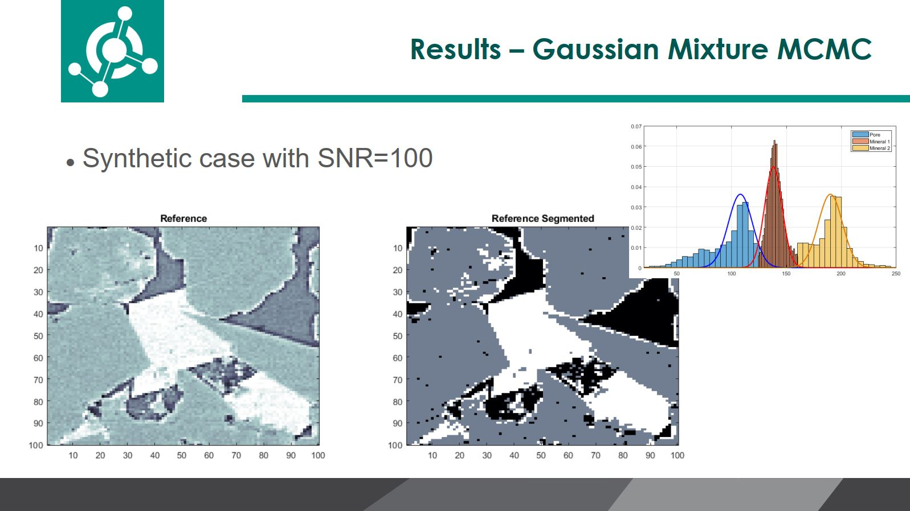
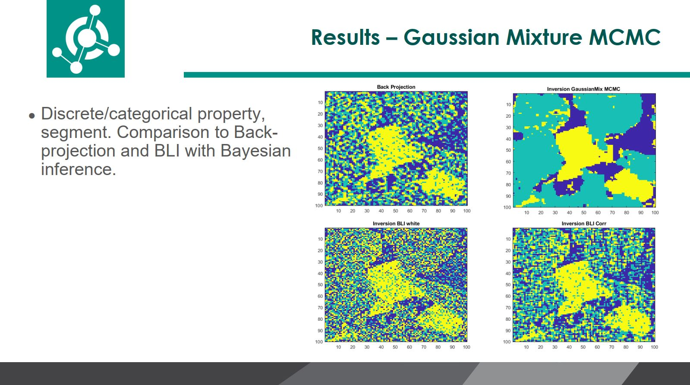

# Gaussian Mixture MCMC - Metropolis applied to CT reconstruction/inversion

### Gaussian mixture Markov chain Monte Carlo method for linear CT reconstruction/inversion ###

This algorithm is related to the publication referenced below. The article discusses a particlar case of application of  facies seismic inversion. In this repository, the same methodology is applied for  CT reconstruction/inversion. 

Leandro Passos de Figueiredo, Dario Grana, Mauro Roisenberg, and Bruno B. Rodrigues, (2019), "Gaussian mixture Markov chain Monte Carlo method for linear seismic inversion," GEOPHYSICS 84: R463-R476.
https://doi.org/10.1190/geo2018-0529.1

### Example

Just run the script main_inversionCT.m to obtain the results/images shown below

# Erratum on the article

After a few months of publication we realized that p(d|π) is much simpler than what we have presented in the article. In the code of this repository, one can see how we actually p(d|π) use it in the algorithm.

Because both distributions p(d|m) and p(m|π) are assumed to be Gaussians, p(d|π) is also a Gaussian distribution

